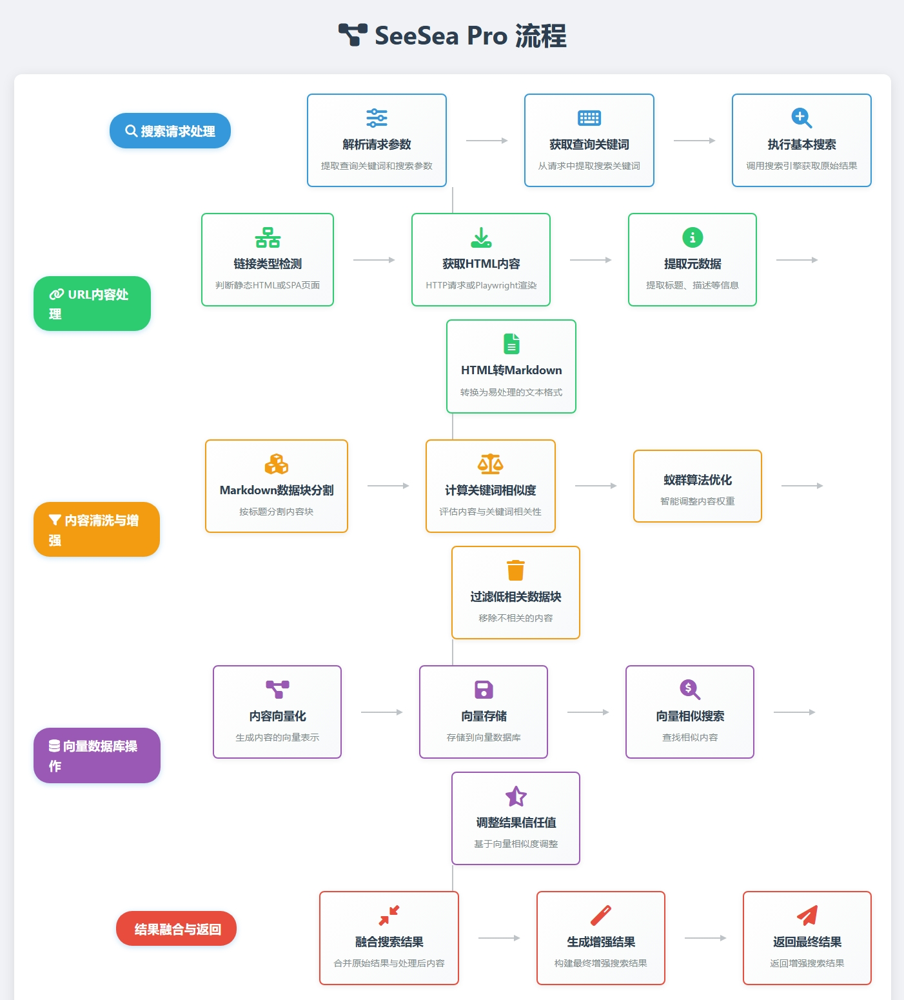

# SeeSea - 高质量的搜索解决方案


<div align="center">

**🛡️ 基于 Rust 的隐私优先多模态搜索平台**

[](https://www.rust-lang.org)
[](LICENSE)
[]()
[](https://www.python.org)

*整合网页搜索、RSS 聚合和浏览器自动化，提供隐私保护的多模态搜索体验*

</div>

---

## 📋 中文索引

- [🌟 项目概述](#-项目概述)
- [🚀 核心能力](#-核心能力)
- [🏗️ 技术架构](#-技术架构)
- [🎮 使用方式](#-使用方式)
- [⚙️ 配置与部署](#-配置与部署)
- [📦 自包含安装程序](#-自包含安装程序)
- [📊 性能特性](#-性能特性)
- [🔧 开发与扩展](#-开发与扩展)
- [🛡️ 隐私说明](#-隐私说明)
- [📚 文档与资源](#-文档与资源)
- [🤝 贡献](#-贡献)
- [📄 许可证](#-许可证)
- [🙏 致谢](#-致谢)

---

## 🌟 项目概述

SeeSea 是一个以隐私保护为核心的多模态搜索平台，通过 Rust 构建高性能核心引擎，整合多种搜索源，支持智能缓存和语义匹配。平台提供网页搜索、RSS 聚合、浏览器自动化和增强搜索（Pro）功能，适合任何搜索场景的应用和数据分析的场景。

### 🎯 核心价值

- **🛡️ 隐私保护**：集成 Tor 网络、TLS 指纹混淆、DNS over HTTPS 等技术，保护用户搜索隐私
- **🔍 多源整合**：结合网页搜索、RSS 订阅和浏览器自动化三种数据获取方式
- **⚡ 高效性能**：基于 Rust 异步编程，支持多引擎并发查询
- **🧠 智能缓存**：实现语义级缓存，支持向量相似性匹配和结果去重
- **🚀 增强搜索（Pro）**：深入处理网页内容，提供基于向量的增强搜索结果
- **🔧 实用工具**：提供完整的监控、配置管理和 REST API 接口
- **🐍 Python 支持**：提供 Python SDK，支持灵活的引擎扩展和集成

---

## 🚀 核心能力

### 1. 多搜索引擎聚合

支持 12 种搜索引擎，覆盖不同搜索场景：

| 引擎类别 | 搜索引擎 | 功能说明 |
|---------|---------|----------|
| **通用搜索** | Bing、Yandex、百度、搜狗 | 支持多语言通用搜索 |
| **图片搜索** | Unsplash、Bing Images | 提供高质量免费图片资源 |
| **视频搜索** | Bilibili、Bing Videos | 覆盖中文视频平台 |
| **新闻搜索** | Bing News | 提供实时新闻资讯 |
| **社交搜索** | 搜狗微信 | 支持微信公众号内容搜索 |

### 2. 隐私保护机制

实现多层次隐私保护：

- **网络层保护**：TLS 指纹混淆、请求头伪造、User-Agent 轮换
- **Tor 网络集成**：支持 SOCKS5 代理访问、控制端口管理、多种使用模式
- **反指纹技术**：Canvas/WebGL 指纹屏蔽、浏览器指纹对抗
- **流量混淆**：请求时序随机化、智能限流、流量特征混淆
- **追踪防护**：DNS over HTTPS、请求去标识化、Cookie 隔离

### 3. 智能缓存系统

基于向量的语义缓存设计：

- **语义匹配**：结合 BM25 算法和向量相似性进行缓存命中判断
- **时间管理**：支持可配置的缓存过期时间和自动清理
- **分层存储**：分别缓存搜索结果、RSS 源和元数据
- **性能监控**：提供缓存命中率、性能指标等监控数据

### 4. RSS 内容聚合

提供完整的 RSS 处理功能：

- **自动抓取**：支持定时更新和内容解析
- **模板系统**：允许自定义 RSS 内容处理模板
- **更新配置**：可设置更新频率和内容过滤规则
- **内容关联**：与搜索结果进行语义关联

### 5. 浏览器自动化

集成 Playwright 浏览器自动化：

- **复杂网站支持**：处理 JavaScript 重度依赖的网站
- **并发执行**：支持多浏览器实例同时抓取
- **精准提取**：提供精准的内容提取和数据清洗

### 6. 增强搜索（Pro）

提供深度内容处理和向量增强搜索：

- **链接类型智能检测**：自动区分静态HTML和SPA页面
- **HTML深度处理**：获取完整内容，提取元数据，转换为Markdown
- **智能内容清洗**：基于蚁群算法的相关性分析，过滤低相关内容
- **向量增强**：内容向量化存储，基于语义相似度调整结果信任值
- **相似文档推荐**：支持基于内容的相似文档搜索
- **完整流程**：

```
搜索请求 → 原始结果获取 → URL内容处理 → 向量存储 → 结果融合 → 返回增强结果
```



---

## 🏗️ 技术架构

### 系统架构

```
┌─────────────────────────────────────────────────────────────┐
│                     用户接口层                              │
├─────────────────┬─────────────────┬─────────────────────────┤
│   CLI 工具      │   REST API      │   Python 绑定           │
└─────────────────┴─────────────────┴─────────────────────────┘
                            │
┌─────────────────────────────────────────────────────────────┐
│                     核心服务层                              │
├─────────────────┬─────────────────┬─────────────────────────┤
│   搜索编排器    │   结果聚合器    │   查询处理器             │
└─────────────────┴─────────────────┴─────────────────────────┘
                            │
┌─────────────────────────────────────────────────────────────┐
│                    搜索引擎层                               │
├─────────────────┬─────────────────┬─────────────────────────┤
│   Web搜索引擎   │   RSS聚合器     │   浏览器引擎             │
└─────────────────┴─────────────────┴─────────────────────────┘
                            │
┌─────────────────────────────────────────────────────────────┐
│                    基础设施层                               │
├─────────────────┬─────────────────┬─────────────────────────┤
│   隐私网络      │   缓存系统      │   配置管理              │
└─────────────────┴─────────────────┴─────────────────────────┘
```

### 技术栈

- **Rust 2024**：高性能、内存安全的系统编程语言
- **Tokio**：异步运行时，支持高并发处理
- **Axum**：现代化的 Web 框架
- **Sled**：高性能嵌入式数据库
- **Playwright**：浏览器自动化框架
- **PyO3**：Python-Rust 绑定
- **NumPy**：Python 数值计算库
- **Markitdown**：HTML 到 Markdown 转换

---

## 🎮 使用方式

### 1. CLI 命令行工具

```bash
# 基础搜索
seesea search ＜关键词＞

# API 服务器
seesea server --host 0.0.0.0 --port 3001 -c config/development.toml
```

### 2. REST API

```bash
# 启动 API 服务器
cargo run --bin api-server

# 搜索接口
curl "http://localhost:8080/api/search?q=人工智能&engines=bing,baidu"

# RSS 管理
curl "http://localhost:8080/api/rss/feeds"
curl "http://localhost:8080/api/rss/fetch?url=https://example.com/feed.xml"

# 缓存统计
curl "http://localhost:8080/api/cache/stats"

# 健康检查
curl "http://localhost:8080/api/health"
```

**注意事项**：
- Python命令行默认启动的服务器为内网模式，**默认不启用认证**
- 只有通过配置文件启动并设置 `mode = "external"` 或 `mode = "dual"` 时，才会启用外网模式
- 外网模式可通过配置文件启用API密钥认证或JWT认证
- 生产环境建议使用配置文件启用认证，确保服务安全
- 配置文件示例：
  ```toml
  [api.auth]
  enabled = true
  auth_type = "api_key"
  api_keys = ["your-secret-api-key"]
  ```

### 3. Python 集成

```python
import seesea

# 基础搜索（使用内置 Rust 引擎）
results = seesea.search("深度学习", engines=["bing", "baidu"])

# 隐私搜索（启用 Tor）
results = seesea.search_privacy("隐私技术",
                               enable_tor=True,
                               fingerprint_protection=True)

# RSS 订阅
feeds = seesea.fetch_rss("https://example.com/feed.xml")

# Pro 增强搜索
from seesea.Pro import ContentProcessor, VectorUtils

# 创建内容处理器
processor = ContentProcessor()

# 处理单个URL内容
processed_data = await processor.process_url("https://example.com/article", keywords="深度学习")

# 创建向量工具
vector_utils = VectorUtils()

# 添加文档到向量数据库
vector_utils.add_document(
    content=processed_data["cleaned_markdown"],
    metadata={
        "title": processed_data["metadata"]["title"],
        "url": processed_data["url"]
    }
)

# 向量相似搜索
vector_results = vector_utils.search("深度学习", limit=10)

# 注册自定义搜索引擎
from seesea import register_engine, BrowserEngine

# 方式1：使用装饰器注册 Python 引擎
@seesea.register_engine(
    name="custom_search",
    engine_type="general",
    description="自定义搜索引擎"
)
def custom_search_callback(query: str) -> list:
    # 实现自定义搜索逻辑
    return [{"title": "示例结果", "url": "https://example.com"}]

# 方式2：继承 BrowserEngine 创建浏览器引擎
class MyBrowserEngine(BrowserEngine):
    async def search(self, query: str, page: int = 1):
        async with self.get_browser() as browser:
            page = await browser.new_page()
            await page.goto(f"https://example.com/search?q={query}")
            results = await page.query_selector_all('.result')
            return [self.parse_result(r) for r in results]

# 注册浏览器引擎
seesea.register_engine(
    name="my_browser",
    engine_type="browser",
    description="自定义浏览器引擎",
    callback=MyBrowserEngine().search
)

# 使用混合引擎搜索
results = seesea.search("查询", engines=["bing", "custom_search", "my_browser"])
```

---

## ⚙️ 配置与部署

### 环境配置

SeeSea 支持多环境配置，示例配置文件：

```toml
# config/development.toml
# SeeSea 开发环境完整配置文件
# 这是 SeeSea 元搜索引擎的完整配置，包含所有必要的设置

# =============================================================================
# 通用配置
# =============================================================================
[general]
# 应用实例名称
instance_name = "SeeSea"
# 是否启用调试模式
debug = true
# 引擎加载模式: "global" 或 "settings"
engine_loading_mode = "global"
# 是否启用指标收集
enable_metrics = true
# 默认语言
default_lang = "auto"
# 运行环境: "development", "testing", "staging", "production"
environment = "development"

# =============================================================================
# 服务器配置
# =============================================================================
[server]
# 绑定地址
bind_address = "127.0.0.1"
# 端口号
port = 3001
# 是否启用限流
limiter = true
# 是否为公共实例
public_instance = false
# 服务密钥（生产环境请更改！）
secret_key = "change-me-in-production-please-generate-a-strong-secret-key"

# TLS 配置（HTTPS）
[server.tls]
enabled = false

# =============================================================================
# 搜索配置
# =============================================================================
[search]
# 安全搜索级别: 0=无, 1=中等, 2=严格
safe_search = "none"
# 自动完成引擎
autocomplete = ""
# 支持的输出格式
formats = ["json", "html", "csv", "rss"]
# 默认每页结果数
results_per_page = 10
# 最大结果数
max_results_per_page = 50
# 搜索超时时间（秒）
search_timeout = 15
# 最大并发引擎数
max_concurrent_engines = 3
# 默认语言
default_language = "auto"
# 支持的语言
supported_languages = ["en", "zh", "ja", "ko", "es", "fr", "de", "ru"]
# 是否支持时间范围
time_range_support = true

# 结果聚合配置
[search.aggregation]
# 启用结果去重
enable_deduplication = true
# 去重算法
deduplication_method = "url_and_title"
# 启用结果排序
enable_ranking = true
# 排序算法
ranking_algorithm = "hybrid"
# 最大聚合结果数
max_results = 100
# 启用结果分组
enable_grouping = true
# 分组策略
grouping_strategy = "smart"

# 查询处理配置
[search.query_processing]
# 启用查询扩展
enable_expansion = true
# 启用查询纠正
enable_correction = true
# 纠正阈值
correction_threshold = 0.8
# 启用同义词扩展
enable_synonyms = true
# 启用停用词过滤
enable_stop_words = true
# 最大查询长度
max_query_length = 200
# 最小查询长度
min_query_length = 1

# =============================================================================
# 隐私保护配置
# =============================================================================
[privacy]

# User-Agent 轮换配置
[privacy.user_agent_rotation]
enabled = false
# 轮换策略
rotation_strategy = "random"
# 轮换间隔（请求数）
rotation_interval = 10
# 是否包含移动端 UA
include_mobile = false
# 按浏览器类型分组
group_by_browser = true

# TLS 指纹保护配置
[privacy.fingerprint_protection]
# 保护级别: "none", "basic", "advanced", "maximum"
protection_level = "none"
# 随机化 TLS 扩展
randomize_extensions = true
# 随机化密码套件
randomize_cipher_suites = true
# 模拟常见浏览器
emulate_browsers = true

# 请求时序随机化配置
[privacy.request_timing]
# 时序策略
timing_strategy = "light"
# 最小延迟（毫秒）
min_delay = 100
# 最大延迟（毫秒）
max_delay = 2000
# 基于请求大小调整延迟
size_based_delay = true
# 基于引擎调整延迟
engine_based_delay = true

# DNS 配置
[privacy.dns_config]
# 是否启用 DNS over HTTPS
enabled = true
# DNS 服务器列表（包含国内外服务商）
[[privacy.dns_config.servers]]
name = "Cloudflare"
url = "https://cloudflare-dns.com/dns-query"
enabled = true
weight = 1.0

[[privacy.dns_config.servers]]
name = "Google"
url = "https://dns.google/dns-query"
enabled = true
weight = 1.0

[[privacy.dns_config.servers]]
name = "阿里云"
url = "https://dns.alidns.com/dns-query"
enabled = true
weight = 1.2

[[privacy.dns_config.servers]]
name = "腾讯 DNSPod"
url = "https://doh.pub/dns-query"
enabled = true
weight = 1.2

[[privacy.dns_config.servers]]
name = "360 DoH"
url = "https://doh.360.cn/dns-query"
enabled = true
weight = 1.1

# DNS 超时时间（毫秒）
timeout = 5000
# 重试次数
retry_count = 2
# 是否启用 DNS 缓存
enable_cache = true
# 缓存过期时间（秒）
cache_ttl = 300

# 请求头配置
[privacy.headers]
# 移除隐私敏感头
remove_privacy_headers = true
# 标准化 Accept 头
normalize_accept = true
# 随机化其他头
randomize_headers = false

# Cookie 处理配置
[privacy.cookie_handling]
# 是否接受 Cookie
accept_cookies = false
# 是否发送 Cookie
send_cookies = false
# 过滤策略
filter_policy = "disabled"

# =============================================================================
# 缓存配置
# =============================================================================
[cache]
# 缓存后端: "sled", "redis", "memory", "hybrid"
backend = "sled"
# 数据库路径（使用 .seesea 目录）
database_path = ".seesea/cache.db"
# 缓存过期时间（秒）
ttl = 3600
# 最大缓存大小（字节）
max_size = 1073741824  # 1GB
# 是否启用结果缓存
enable_result_cache = true
# 是否启用元数据缓存
enable_metadata_cache = true
# 是否启用 DNS 缓存
enable_dns_cache = true
# 是否启用 RSS 缓存
enable_rss_cache = true
# 缓存刷新间隔（秒）
refresh_interval = 300
# 淘汰策略
eviction_policy = "ttl"

# 压缩配置
[cache.compression]
# 是否启用压缩
enabled = true
# 压缩算法
algorithm = "lz4"
# 压缩阈值（字节）
threshold = 1024
# 压缩级别
level = 3

# 监控配置
[cache.monitoring]
# 是否启用监控
enabled = true
# 指标收集间隔（秒）
metrics_interval = 60
# 是否启用慢查询日志
enable_slow_query_log = true
# 慢查询阈值（毫秒）
slow_query_threshold = 1000

# =============================================================================
# API 配置
# =============================================================================
[api]
# API 版本
version = "v1"
# 是否启用 CORS
enable_cors = true

# CORS 配置
[api.cors]
# 允许的源
allowed_origins = ["*"]
# 允许的方法
allowed_methods = ["GET", "POST", "PUT", "DELETE", "OPTIONS"]
# 是否允许凭证
allow_credentials = false

# 速率限制配置
[api.rate_limit]
# 是否启用速率限制
enabled = true
# 每秒请求数
requests_per_second = 10
# 每分钟请求数
requests_per_minute = 100
# 每小时请求数
requests_per_hour = 1000
# 每天请求数
requests_per_day = 10000
# 突发请求限制
burst_size = 20

# 认证配置
[api.auth]
# 是否启用认证
enabled = false
# 认证类型: "none", "api_key", "jwt", "basic"
auth_type = "none"

# 响应格式配置
[api.response_format]
# 默认格式
default_format = "json"
# 支持的格式
supported_formats = ["json", "xml", "csv"]
# 是否包含调试信息
include_debug_info = false
# 是否包含性能指标
include_metrics = true
# 是否包含请求 ID
include_request_id = true

# 响应压缩配置
[api.response_format.compression]
# 是否启用
enabled = true
# 压缩算法
algorithms = ["gzip", "deflate"]
# 压缩阈值
threshold = 1024

# API 安全配置
[api.security]
# 是否强制 HTTPS
force_https = false

# API 文档配置
[api.documentation]
# 是否启用
enabled = true
# 文档类型
doc_type = "openapi3"
# 文档路径
path = "/docs"
# 是否包含示例
include_examples = true

# =============================================================================
# 引擎配置
# =============================================================================
[engines]

# 全局引擎设置
[engines.global_settings]
# 默认超时时间（秒）
default_timeout = 30
# 默认重试次数
default_retries = 3
# 最大并发引擎数
max_concurrent_engines = 5
# 引擎失败阈值（0.0-1.0）
failure_threshold = 0.5
# 引擎恢复时间（秒）
recovery_time = 300
# 是否启用引擎监控
enable_monitoring = true
# 是否启用性能统计
performance_stats = true

# =============================================================================
# 日志配置
# =============================================================================
[logging]
# 日志级别: "error", "warn", "info", "debug", "trace"
level = "debug"
# 日志格式: "simple", "full", "json", "compact"
format = "full"
# 日志输出: "stdout", "stderr", "file", "both"
output = "stdout"
# 是否启用结构化日志
structured = false
# 是否启用彩色输出
colored = true

# =============================================================================
# RSS Feed 配置
# =============================================================================
[rss]
# 是否启用 RSS 功能
enabled = true
# RSS 模板目录
template_dir = "rss/template"
# 配置文件路径
config_path = ".seesea/rss_config.toml"
# 默认更新间隔（秒）
default_update_interval = 3600  # 1 hour
# 最大保留项目数
max_items_per_feed = 1000
# 是否启用自动更新
auto_update = true
# 启动时更新持久化 RSS
update_on_startup = true

# =============================================================================
# 语义缓存配置
# =============================================================================
[cache.semantic]
# 是否启用语义缓存
enabled = true
# 相似度阈值（0.0-1.0，建议0.7-0.85）
similarity_threshold = 0.75
# 每个查询最大返回结果数
max_results_per_query = 50
# 是否启用跨查询去重
enable_deduplication = true
```

### 快速部署

```bash
# 1. 准备 Rust 环境
rustup update stable

# 2. 构建项目
git clone https://github.com/nostalgiatan/SeeSea.git
cd SeeSea
maturin build --release --strip
cd seesea
pip install .
cd crates
pip install markitdown tf

# 3. 配置环境
cp config/production.toml config/local.toml
# 根据需要修改配置文件

# 4. 启动服务
seesea server --port 3001
```
---

## 📦 自包含安装程序

SeeSea 提供了跨平台的自包含安装程序，支持一键安装和卸载，无需手动配置环境。

### 🖥️ 支持平台

- **Windows 10/11** (x64)
- **Linux** (x64, ARM64)
- **macOS** (x64, ARM64)

### 🚀 安装步骤

1. **下载安装程序**
   - 从 [GitHub Releases](https://github.com/yourusername/seesea/releases) 下载对应平台的安装程序
   - 文件名格式：`seesea-installer-<platform>-<arch>.exe` (Windows) 或 `seesea-installer-<platform>-<arch>` (Linux/macOS)

2. **运行安装程序**
   
   **Windows**：
   - 双击 `seesea-installer-windows-x64.exe` 运行
   - 按照安装向导完成安装
   
   **Linux/macOS**：
   ```bash
   # 赋予执行权限
   chmod +x seesea-installer-<platform>-<arch>
   # 运行安装程序
   ./seesea-installer-<platform>-<arch>
   ```

3. **自定义安装选项**
   - 安装目录：默认为系统标准安装目录
   - 创建桌面快捷方式：默认启用
   - 添加到 PATH 环境变量：默认启用
   - 创建卸载程序：默认启用

### 🗑️ 卸载步骤

**Windows**：
- 通过「控制面板 > 程序 > 卸载程序」找到 SeeSea 并卸载
- 或使用开始菜单中的「卸载 SeeSea」快捷方式

**Linux/macOS**：
```bash
# 使用卸载脚本
seesea-installer uninstall
```

### ⚙️ 命令行安装选项

```bash
# 查看帮助
seesea-installer --help

# 自定义安装目录
seesea-installer --install-dir /opt/seesea

# 静默安装（无交互）
seesea-installer --quiet

# 正常安装
seesea-installer install

# 卸载
seesea-installer uninstall
```

---

## 📊 性能特性

### 测试数据

| 指标 | 数值 | 说明 |
|------|------|------|
| **并发搜索** | 10+ 引擎同时查询 | 基于异步并发处理 |
| **缓存命中率** | 85%+ | 语义缓存优化效果 |
| **响应时间** | 11-17秒 | 多引擎并发搜索延迟 |
| **内存使用** | 峰值132MB | 低内存占用，适合边缘部署 |
| **隐私开销** | < 15% | 隐私保护功能的性能损耗 |

---

## 🔧 开发与扩展

### 添加新搜索引擎

```rust
use seesea_derive::search_engine;

#[search_engine]
pub struct MyCustomEngine {
    name: "my_engine",
    base_url: "https://api.example.com/search",
    supports_images: true,
    supports_news: false,
}

impl MyCustomEngine {
    async fn search_impl(&self, query: &SearchQuery) -> Result<Vec<SearchResult>> {
        // 实现自定义搜索逻辑
    }
}
```

### 自定义隐私策略

```rust
use seesea::privacy::PrivacyStrategy;

struct CustomPrivacyStrategy;

impl PrivacyStrategy for CustomPrivacyStrategy {
    async fn apply_headers(&self) -> HeaderMap {
        // 自定义请求头
    }

    async fn rotate_fingerprint(&self) -> Fingerprint {
        // 自定义指纹轮换
    }
}
```

---

## 🛡️ 隐私说明

### 已实现的隐私技术

- **DNS over HTTPS**：防止 DNS 泄露
- **TLS 指纹混淆**：避免流量分析
- **浏览器指纹对抗**：防止设备识别
- **Tor 网络集成**：支持匿名访问
- **请求去标识化**：移除隐私敏感信息
- **流量混淆**：对抗流量分析

### 数据收集说明

SeeSea 不收集或存储：
- 用户搜索历史
- 用户 IP 地址
- 设备指纹信息
- 用户行为数据

### 开源透明

- 所有代码公开可审计
- 支持本地私有部署
- 隐私保护效果可独立验证

---

## 📚 文档与资源

### 📖 详细文档

- [API 参考](docs/API.md) - 完整的 API 文档
- [搜索引擎开发](docs/ENGINE_CUSTOMIZATION.md) - 自定义引擎开发指南
- [搜索使用指南](docs/SEARCH_USAGE.md) - 搜索 API 使用示例
- [类型系统](docs/TYPE_SYSTEM.md) - Python 和 Rust 类型参考
- [最佳实践](docs/BEST_PRACTICES.md) - 推荐使用模式和技巧
- [目录结构](docs/DIRECTORY_STRUCTURE.md) - 项目组织结构
- [全文搜索指南](docs/fulltext-search-guide.md) - 数据库和 RSS 集成

### 🧪 示例项目

- [examples/api_dual_network.rs](examples/api_dual_network.rs) - 双网络 API 服务器示例
- [examples/api_server.rs](examples/api_server.rs) - 简单 API 服务器示例
- [examples/api_simple_server.rs](examples/api_simple_server.rs) - 简单 API 服务器示例
- [examples/browser_usage.py](examples/browser_usage.py) - 浏览器自动化示例
- [examples/python_api_usage.py](examples/python_api_usage.py) - Python API 使用示例

### 🔬 测试

```bash
# 运行所有测试
cargo test

# 性能测试
cargo bench

# 集成测试
cargo test --test integration
```

---

## 🤝 贡献

欢迎社区贡献，主要贡献方向包括：

- 🔍 新增搜索引擎支持
- 🛡️ 增强隐私保护能力
- 🧠 改进搜索算法和结果排序
- 📊 完善性能监控
- 📚 提升文档质量

---

## 📄 许可证

本项目采用 [Apache-2.0 许可证](LICENSE)。

---

## 🙏 致谢

感谢以下开源项目的支持：

- [Tokio](https://tokio.rs/) - 异步运行时
- [Axum](https://github.com/tokio-rs/axum) - Web 框架
- [Sled](https://github.com/spacejam/sled) - 嵌入式数据库
- [Playwright](https://playwright.dev/) - 浏览器自动化
- [PyO3](https://pyo3.rs/) - Python 绑定

---

<div align="center">

**🌊 SeeSea - 隐私保护的多模态搜索平台**

*保护隐私，自由搜索*

[GitHub](https://github.com/your-org/seesea) | [文档](docs/) | [社区](https://qun.qq.com/universal-share/share?ac=1&authKey=MYqYYdBkXIIpLy53qACJ8UX8o5aA%2FcjbrdlGdIYGf1MAdUhnHySxbLkrmTJf8ae5&busi_data=eyJncm91cENvZGUiOiIxMDE0MTE3NjE1IiwidG9rZW4iOiJWcXNpVWc1RThoZEtRZTJ3dGE5UUR3bHEwMmxURjhUcTgyc25aZHF1SlU1Nkgyeko0MTdJT0pVY3M4d3h0M0JOIiwidWluIjoiMjk2NTMxMjA3NiJ9&data=efjbukPAWz15OdH4I6uhGOqu2ao4DmcL20OpLBA3zu9x-0Cv8cQvMaNh_NnaxHePTIT4DXeCyILo8cH4uvDVkw&svctype=4&tempid=h5_group_info)

</div>
